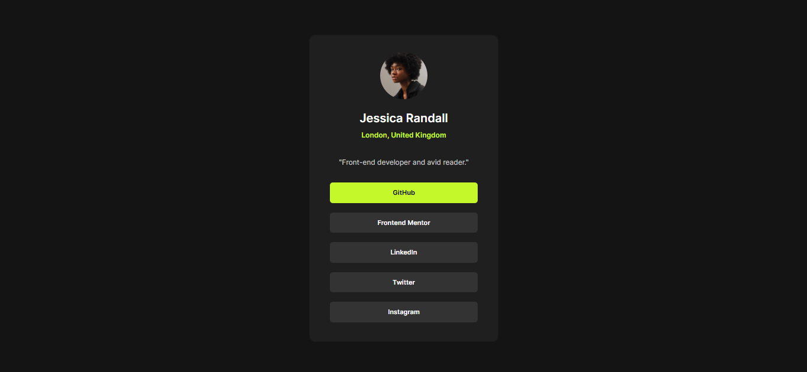
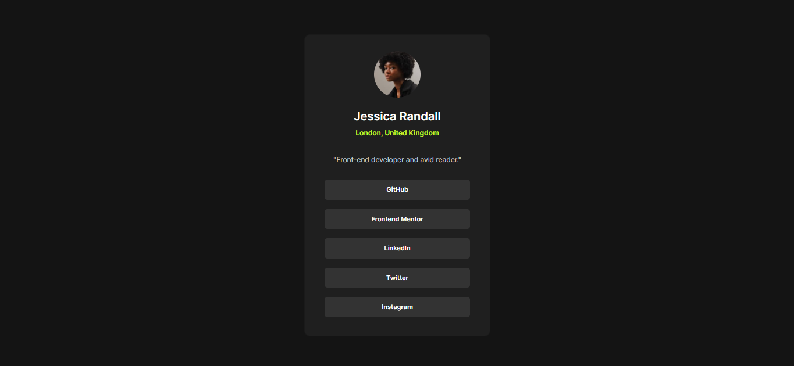
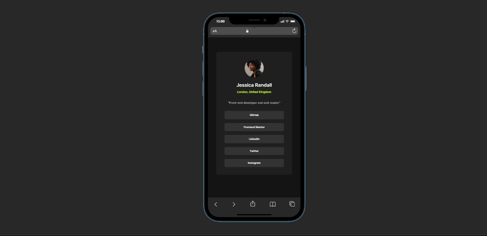

# Frontend Mentor - Social links profile solution

This is a solution to the [Social links profile challenge on Frontend Mentor](https://www.frontendmentor.io/challenges/social-links-profile-UG32l9m6dQ). Frontend Mentor challenges help you improve your coding skills by building realistic projects. 

## Table of contents

- [Overview](#overview)
  - [Screenshot](#screenshot)
  - [Links](#links)
- [My process](#my-process)
  - [Built with](#built-with)
  - [Continued development](#continued-development)
  - [Useful resources](#useful-resources)
- [Author](#author)
- [Acknowledgments](#acknowledgments)

## Overview

### Screenshot

### Links

- Solution URL: [https://github.com/micdynas/social-links-profile-main](https://your-solution-url.com)
- Live Site URL: [https://micdynas.github.io/social-links-profile-main/](https://your-live-site-url.com)

## My process

### Built with

- Semantic HTML5 markup
- CSS custom properties
- Bootstrap

### Continued development
i want to learn how to reduce the amount of code i write in my css

### Useful resources

- (https://getbootstrap.com/docs/5.3/components/card/)- At some point i got stuck on how to implement the card component in bootstrap and this helped

## Author
- Frontend Mentor - @micdynas